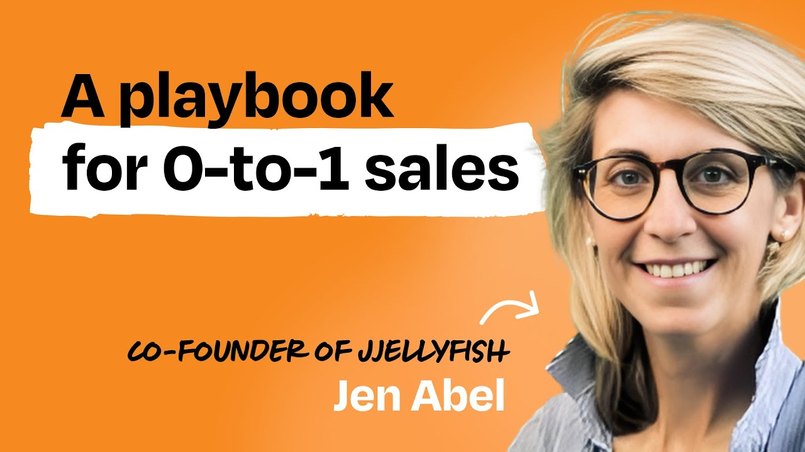
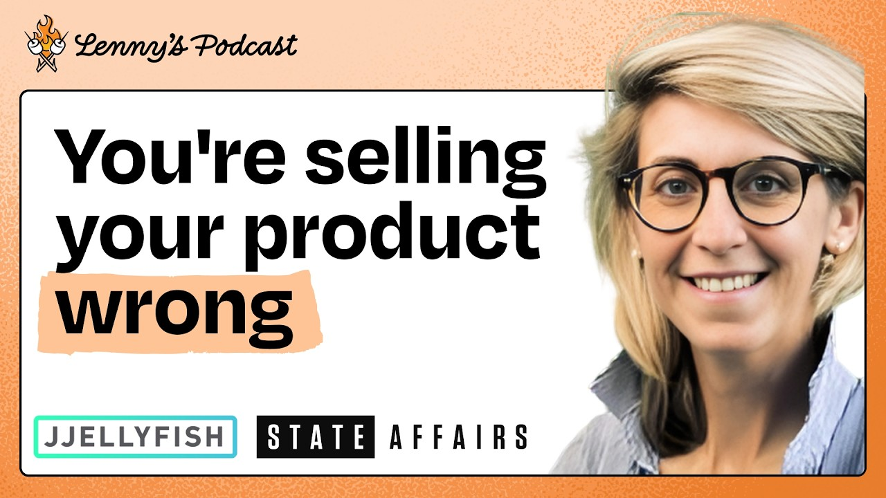
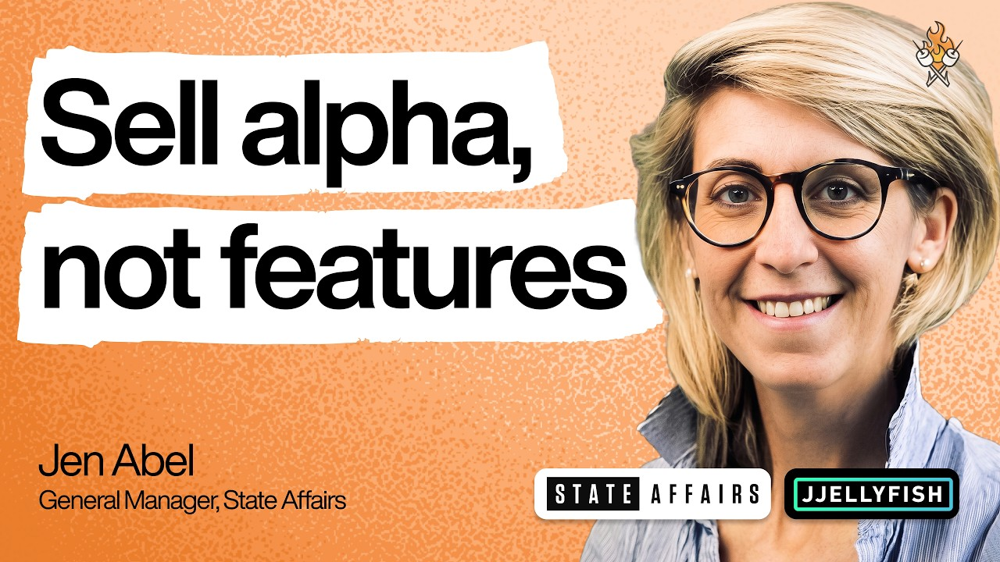
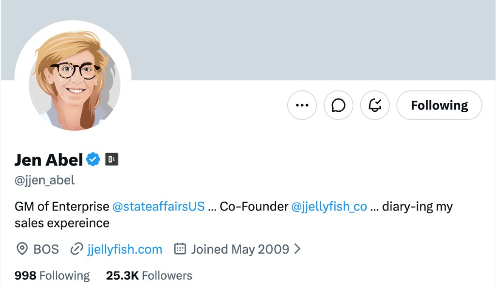

# Enterprise Sales Knowledge Base

  
  
  
  

Practical notes on Jen Abel's enterprise sales approach. Use them in a live deal: how to run the next step, how to qualify, how to handle a stall or objection.

These are Markdown files. There is nothing to install or run.

## Start here

- [00 Start Here](<00 Start Here.md>) — hub for the whole set
- [Sales map](<05 Maps/Jen Abel Enterprise Sales Map.md>) — the ideas in order
- [Full enterprise sales cycle](<03 Playbooks/Full Enterprise Sales Cycle.md>) — the 15-step playbook

## How to use it

Clone or open this repo in your agent (Cursor, Claude Code, Codex, Grok, or similar). Point the agent at the notes and ask about a live deal: the next step, a stall, an objection, how to run a call.

Most of those tools read [AGENTS.md](<AGENTS.md>) automatically. If yours does not, tell it to treat that file as project instructions and to use the playbooks as the source of advice.

## What's inside

| Folder | Use it for |
| --- | --- |
| [03 Playbooks](<03 Playbooks>) | Running a deal: outbound, discovery, demos, pilots, pricing, procurement, expansion |
| [02 Core Concepts](<02 Core Concepts>) | Mental models: founder-led sales, qualification, how enterprise buying actually works |
| [04 Hiring](<04 Hiring>) | The first sales hire |
| [01 Source Notes](<01 Source Notes>) | Where the advice came from (public X posts and talks) |

The core idea: enterprise sales is not a better pitch. Learn faster than the market, get insider context, help the buyer write the internal story, and project-manage the buying process.

## References

Public sources this knowledge base is drawn from:

- X: [Jen Abel (@jjen_abel)](https://x.com/jjen_abel)
- [The ultimate guide to founder-led sales | Jen Abel](https://www.youtube.com/watch?v=969dwgu98qc) — Lenny's Podcast
- [$1M to $10M: The enterprise sales playbook with Jen Abel](https://www.youtube.com/watch?v=37fKFWdrMyA) — Lenny's Podcast
- [84 minutes of enterprise sales alpha | Jen Abel](https://www.youtube.com/watch?v=YS9In813jJ0) — Lenny's Podcast
